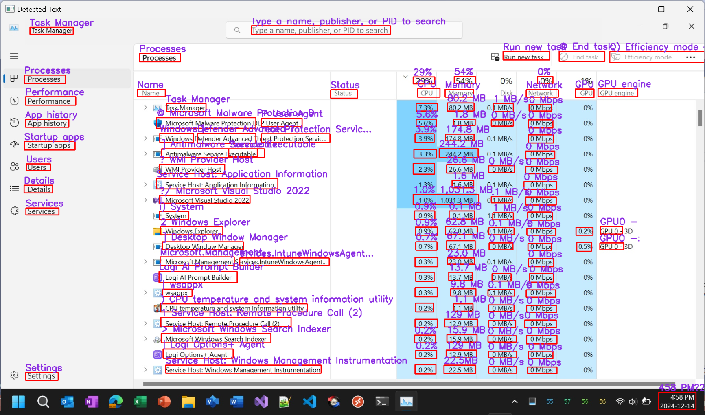

# Text Detection and OCR with OpenCV and Tesseract

This C# project performs text detection and optical character recognition (OCR) on images using OpenCV's EAST text detector and Tesseract OCR engine. It extracts text from images, draws bounding boxes around detected text, and optionally processes the text with Tesseract to extract and display the content.

## Snapshot

## Features

- Text detection using the EAST model from OpenCV.
- OCR with Tesseract to extract text.
- Bounding box drawing around detected text regions.
- Ability to merge overlapping bounding boxes for cleaner detection.
- Resizing and displaying the processed image with detected text.

## Requirements

- .NET Core or .NET Framework
- OpenCVSharp
- Tesseract OCR
- EAST text detection model (`frozen_east_text_detection.pb`)
- Tesseract language data (`tessdata`)

## Setup

1. Clone this repository.
2. Install the required dependencies:
   - OpenCVSharp
   - Tesseract
3. Download the `frozen_east_text_detection.pb` model and place it in the project directory.
4. Ensure the Tesseract `tessdata` folder is correctly set up with the language files.
5. Run the project, providing an image for text detection.

## Usage

- The application will process the input image, detect text regions, and optionally run OCR to extract the text.
- Detected text will be displayed on the image with bounding boxes and extracted text, which can be viewed in the console.

## License

This project is licensed under the MIT License - see the [LICENSE](LICENSE) file for details.
